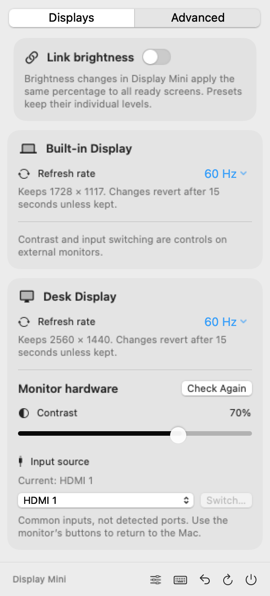

# Display Mini

[](https://github.com/albert2704/display-mini/actions/workflows/ci.yml)
[](LICENSE)

A small, open source macOS menu bar app for **brightness, resolution, monitor volume, presets, and keyboard shortcuts**, with an **Advanced tab** for contrast, input switching, linked brightness and refresh rates.

<p align="center">
  
</p>

*Native interface examples from version 0.3.0, rendered with sample data. Monitor support and available resolutions depend on your setup.*

[Install](#install) · [Quick tour](#quick-tour) · [User guide](docs/USER_GUIDE.md) · [Troubleshooting](docs/TROUBLESHOOTING.md)

Written in Swift with SwiftUI and AppKit, inspired by the compact controls in BetterDisplay. Display Mini runs independently and is not affiliated with BetterDisplay or DisplayBuddy.

**Status: early preview.** The app has been built and used on an M1 Pro with an LG IPS QHD display. Hardware compatibility is still being validated. Native brightness and connection controls use private macOS APIs, and downloaded builds are locally signed rather than Developer ID signed or notarized.

## Quick tour

The silent, captioned walkthrough covers the panel, presets, and recording a shortcut. It uses sample UI states rather than a live hardware recording.

[](docs/media/walkthrough.mp4)

[Download the 24-second MP4](docs/media/walkthrough.mp4) · [Read the text walkthrough](docs/USER_GUIDE.md#quick-start)

| Save your setup | Record your keys | Check monitor support |
| --- | --- | --- |
|  |  |  |
| [Presets](docs/USER_GUIDE.md#presets) | [Keyboard shortcuts](docs/USER_GUIDE.md#keyboard-shortcuts) | [Connection diagnostics](docs/USER_GUIDE.md#connection-diagnostics-and-response-timing) |

## What it does

| Control | Behavior |
| --- | --- |
| Brightness | Native brightness for built in and Apple displays; DDC/CI for supported external monitors; software dimming when hardware control is unavailable. |
| Combined brightness | Uses the bottom 20% of the slider for extra software dimming below the hardware minimum. |
| Monitor volume | Adjusts the external monitor's speakers through DDC/CI, with readback after a write. |
| Mute | Silences monitor speakers and restores the last confirmed nonzero volume. |
| Presets | Saves named brightness/volume snapshots and applies them to matching connected screens. |
| Keyboard shortcuts | Controls the screen under the pointer; also applies the first three presets. |
| Resolution | Lists modes reported by macOS, including available HiDPI and refresh variants. A preview reverts after 15 seconds unless kept. |
| Favorite resolutions | Stars preferred modes per screen and puts available favorites at the top of its resolution menu. |
| Custom screen names | Labels screens for your setup while preserving their original names and hardware identity. |
| Advanced tab | Keeps extra display controls in a separate view while preserving the recovery footer. |
| Linked brightness | Optionally applies brightness edits made in Display Mini to all ready connected screens. |
| Monitor contrast | Reads the monitor's range and verifies hardware contrast writes on supported connections. |
| Input switching | Sends standard DDC input commands after confirmation, when the monitor reports an identified current input. |
| Refresh rate | Chooses rates reported for the current resolution and pixel dimensions, with Keep/Revert. |
| Connection switch | Disconnects a display from the desktop and reconnects it. The last active display is protected. |
| Recovery | Reconnects displays disconnected by this app, removes dimming, and retries pending resolution recovery. |
| Compatibility profiles | Standard or Slow monitor response timing, remembered per display. |
| Connection diagnostics | Separate brightness and volume results, detected ranges, attempts, verified route, and a copyable report without device identifiers. |

There are no accounts, subscriptions, analytics, updater, virtual displays, or network services in the app.

## Requirements

* Apple Silicon Mac, macOS 14 or later. Intel Macs are not supported by this release.
* A DDC/CI compatible monitor and connection for external hardware brightness and volume.
* Apple Command Line Tools and Swift 5.9 or newer when building from source.

The deployment target is macOS 14, but physical validation so far has been on macOS 27. Supporting a deployment target does not imply every OS version or monitor has been tested.

## Install

Download the arm64 ZIP from [Releases](https://github.com/albert2704/display-mini/releases), expand it, and move **Display Mini.app** to Applications. Open the app, then use its monitor icon in the menu bar.

Preview downloads are not notarized. macOS may block them. Building from source is an alternative for developers; see the [installation guide](docs/INSTALLATION.md) for signing details and checksum verification.

Quit other display control apps before using Display Mini to avoid competing brightness and DDC commands.

## Build from source

```sh
git clone https://github.com/albert2704/display-mini.git
cd display-mini
./scripts/build.sh
./scripts/test.sh
open "dist/Display Mini.app"
```

No third party packages are downloaded during the build. The app bundles the vendored monitor helper. The supported scripts work with Command Line Tools without an Xcode project.

## Personalize your screens

Open the **gear beside a screen's name** to give it a custom label and star favorite resolutions. Names and stars stay local and survive relaunch. Picking a favorite uses the same Keep/Revert preview as any other resolution. See [display personalization](docs/USER_GUIDE.md#screen-names-and-favorite-resolutions).

## Everyday shortcuts

Default bindings (editable from the keyboard button): hold **Control + Option + Command** with:

| Key | Action |
| --- | --- |
| ↑ / ↓ | Brightness up / down by 5 percentage points |
| ← / → | Monitor volume down / up by 5 percentage points |
| M | Monitor mute / unmute |
| 1 / 2 / 3 | Apply the first / second / third saved preset |
| R | Restore displays |

Brightness, volume and mute target the **screen under your pointer**. Open the keyboard button in the footer, select an action, click **Record Shortcut**, press your combination, then **Save**. You can also choose keys from the compact menu, reset defaults, or disable everyday shortcuts. Recovery stays independently enabled, with ⌃⌥⌘R retained as a fallback. Volume needs DDC support. No Accessibility or Input Monitoring permission is required. Registered actions pause while the shortcut editor has focus.

Open the sliders button in the footer to save, rename, apply or delete presets. See the [user guide](docs/USER_GUIDE.md#presets) for matching and failure behavior.

## Advanced controls

Choose **Advanced** at the top of the panel. Link brightness across screens, change refresh rate while keeping the same resolution, or click **Detect** to check an external monitor's contrast and input support.

<picture>
  <source media="(prefers-color-scheme: dark)" srcset="docs/media/advanced-dark.png">
  
</picture>

Input choices are common DDC codes, not a detected port inventory. Switching can remove the Mac's picture; use the monitor's buttons to switch back. Support varies, and vendor specific input protocols are not included. [Read the Advanced guide](docs/USER_GUIDE.md#advanced-tab).

## Recovery shortcut

Press **Control + Option + Command + R**, or click the curved arrow in the footer. Recovery acts on displays and pending changes owned by Display Mini. It does not reset your entire macOS display configuration.

Keep another visible display available when first testing connection controls. Recovery can fail if a monitor is unplugged, cannot be uniquely identified, or macOS rejects the private connection API.

## Documentation

| Guide | Contents |
| --- | --- |
| [Installation](docs/INSTALLATION.md) | Downloads, checksums, source build, updates, removal, and signing. |
| [User guide](docs/USER_GUIDE.md) | Every control, brightness behavior, DDC setup, resolution previews, and recovery. |
| [Troubleshooting](docs/TROUBLESHOOTING.md) | Missing controls, cables, reconnect problems, display changes, and build errors. |
| [Architecture](docs/ARCHITECTURE.md) | Source map, API boundaries, data flow, persistence, and recovery design. |
| [Development and releases](docs/DEVELOPMENT.md) | Toolchain, tests, hardware checks, CI, versioning, and packaging. |
| [Feature research](docs/FEATURE_RESEARCH.md) | BetterDisplay and DisplayBuddy inspiration, implemented scope, and later candidates. |
| [Contributing](CONTRIBUTING.md) | Local workflow, review expectations, and useful compatibility reports. |
| [Security and privacy](SECURITY.md) | Local data, private reporting, and release limitations. |
| [Changelog](CHANGELOG.md) | Version history and preview status. |

## Validation and limits

Nineteen automated logic cases cover 153 assertions, including probe validation, report privacy, brightness math, mode selection, display identity, unplug recovery, mute restore, preset validation and batch completion. Nine shortcut scenarios cover saved preferences, failed-edit rollback, dispatch, reset, recovery, conflicts, keyboard recording and cancellation. Five store scenarios exercise the actual control orchestration with simulated hardware, including canceled writes, recovery reconciliation and shortcut guards. Six subprocess scenarios cover timeout, missing helper, rejection, excessive output and inherited pipes. Objective-C checks cover DDC replies, EDID validation, duplicate identities, selectors beyond the old four-display cap, and timing. These tests do not operate physical monitors.

DDC discovery inspects up to 64 online displays and matches the control service's EDID against the selected screen. Connections without readable EDID and monitors reporting identical identities may remain unavailable. Slow timing can help delayed replies; it cannot make an incompatible dock forward DDC.

Local checks included app launch, accessibility and visual inspection, native display discovery, valid LG brightness/volume reads, and a live disconnect followed by recovery. That check exposed a missing UUID during disconnection; the app now stores the hardware identity and has regression coverage for identity matching. Full hardware mutation and resolution testing remains incomplete. Hosted CI checks compilation and logic, not monitor behavior.

Four personalization model scenarios and three store scenarios cover names, mode geometry and refresh variants, persistence, malformed preferences, storage limits, and stale favorite rejection. Live UI checks confirmed name and favorite persistence across relaunch, followed by removal of the temporary test settings.

Advanced checks cover probe validation, noncontinuous input values, exact refresh geometry, contrast rollback, input delivery, recovery guards, linked edits, persistence and preset isolation. The LG monitor returned valid contrast but no identified standard input; input switching remains unavailable on that tested connection. Hardware write tests remain separate from the automated suite.

## License and attribution

Display Mini is released under the [MIT license](LICENSE). The bundled [m1ddc](https://github.com/waydabber/m1ddc) helper is also MIT licensed. Its original license and local changes are documented in [third party notices](THIRD_PARTY_NOTICES.md). Both licenses are included in the packaged app.
