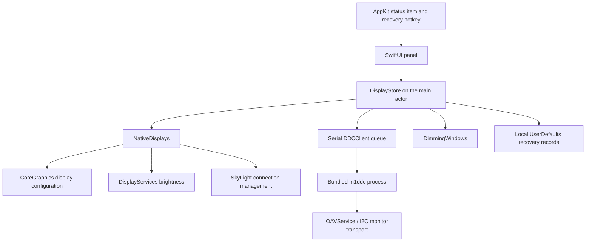

# Architecture

## Runtime layout

No server, network request, account, or external runtime is involved. The app is an accessory application with a status item rather than a Dock window.

## Source map

| File | Responsibility |
| --- | --- |
| `Sources/DisplayMini/AppMain.swift` | App lifecycle, status item, popover, duplicate instance handling, global recovery shortcut. |
| `Sources/DisplayMini/PanelView.swift` | Display cards, control bindings, DDC settings, resolution confirmation, footer. |
| `Sources/DisplayMini/CompactSlider.swift` | Native NSSlider tracking, custom drawing, keyboard accessibility, release callbacks. |
| `Sources/DisplayMini/DisplayStore.swift` | Observable device state, discovery, debounce, operation revisions, recovery, and persistence. |
| `Sources/DisplayMini/Hardware.swift` | CoreGraphics/private API adapters, monitor subprocesses, and overlay windows. |
| `Sources/DisplayCore/ControlMath.swift` | Pure brightness math, parser, mode choice, and hardware identity matching. |
| `Tests/DisplayCoreTests/ControlTests.swift` | A small standalone assertion runner, not XCTest. |
| `Vendor/` | Pinned m1ddc source, MIT license, and locally documented transport fixes. |

## Display discovery and identity

SkyLight's `SLSGetDisplayList` or `CGSGetDisplayList` can include disconnected screens. CoreGraphics online discovery is the fallback. Unknown offline slots are hidden from the panel. NSScreen supplies live display names, and CoreGraphics supplies state, UUIDs, modes, vendor, model, and serial values.

A stable UUID identifies a device in the app. When macOS omits that UUID after disconnection, the saved hardware identity is matched against the fresh private list. Fallback candidates must lack a current UUID, preventing a different identified monitor from receiving an old screen's recovery operation. Multiple matching identities are rejected.

Display IDs are transient. Do not hardcode them, assume list order is stable, or use the first monitor as a substitute for the requested screen.

## Brightness and volume

Brightness for built in and Apple vendor displays dynamically resolves `DisplayServicesGetBrightness` and `DisplayServicesSetBrightness`. Other supported external displays use DDC luminance (`0x10`). Volume uses DDC `0x62`.

Combined brightness reserves a threshold of 0.2:

* At or above the threshold, hardware fraction is `(value - 0.2) / 0.8` and software fraction is 1.
* Below it, hardware is at minimum and software fraction is `max(0.03, value / 0.2)`.
* The native hardware write has a 0.01 floor. Pure software mode uses a 0.03 visibility floor.

Software dimming is a black borderless NSWindow on each screen. It ignores mouse events, joins spaces, and sits below the status bar level. Removing the overlay restores the underlying image; it does not undo a physical backlight change.

DDC processes run on a serial background queue. The helper is addressed by display UUID and receives arguments as an array, never a shell command. Each process has a three second timeout followed by bounded termination. The helper performs three bounded read attempts. A valid response must pass envelope, control, status, and checksum checks. The app requires a positive maximum and scales writes to that range. A successful write is read back before confirmation.

Slider work is debounced by 120 ms. Separate brightness and volume revisions prevent one slider from invalidating the other. Lifecycle/recovery invalidation prevents stale completions from reapplying dimming. UI state changes return to the main actor.

## Resolution transactions

CoreGraphics supplies modes. The app filters for desktop usability and minimum logical dimensions, retains the current mode, and creates one slider choice per logical size. The full menu retains available density and refresh variants.

Preview uses a display configuration transaction with session scope. A common run loop timer counts down from 15 seconds. Keep reapplies with permanent scope; Revert reapplies the original mode. An original-mode recovery record is saved before changing the screen. Failed recovery retains that record, and a later preview must not silently overwrite it.

## Connection transactions

SkyLight's `SLSConfigureDisplayEnabled` or `CGSConfigureDisplayEnabled` is resolved at runtime and called inside a CoreGraphics configuration transaction. The app checks that another active display remains before disconnection, records ownership before changing it, and verifies online state after the change.

A switch changes desktop membership, not the DDC physical power state. Recovery and shutdown reconnect only owned disconnections. Screen changes and wake schedule a debounced refresh.

## Stored data

Domain: `dev.albert.DisplayMini` in local UserDefaults.

| Key | Contents | Purpose |
| --- | --- | --- |
| `displayIdentities` | JSON map of UUID to display ID, vendor, model, serial. | Match disconnected devices when macOS omits UUID. |
| `ownedDisconnects` | Array of display UUIDs. | Retry reconnection on recovery or next launch. |
| `forceSoftware.<UUID>` | Boolean. | Per-display brightness preference. |
| `software.<UUID>` | Fraction. | Per-display dimming state. |
| `resolutionRecovery` | UUID and previous mode ID, logical size, pixel width, refresh. | Recover an unconfirmed mode after failure or restart. |

The app does not upload these records. Monitor serials and UUIDs can identify local hardware and should be redacted from public reports. Synthetic values are used in tests.

## Boundaries and limitations

CoreGraphics configuration is public API; DisplayServices brightness and SkyLight connection calls are private. The helper uses private IOAVService transport and CoreDisplay information. Dynamic lookup handles some missing symbols but cannot guarantee future OS compatibility.

Hosted tests cannot prove physical DDC or connection behavior. Recovery is best effort and depends on the OS still exposing the display and mode. The release is locally signed and is not an App Store or notarized distribution.
