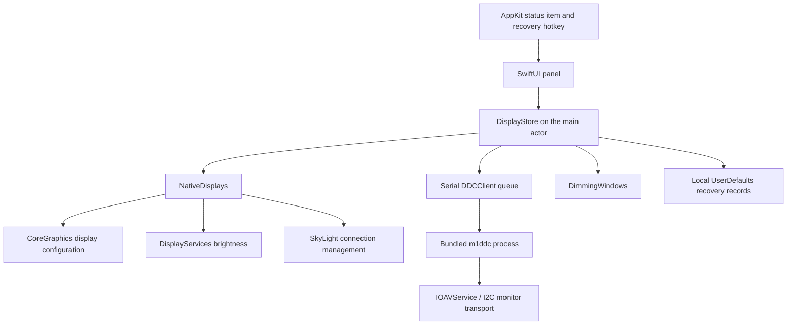

# Architecture

## Runtime layout

No server, network request, account, or external runtime is involved. The app is an accessory application with a status item rather than a Dock window.

## Source map

| File | Responsibility |
| --- | --- |
| `Sources/DisplayMini/AppMain.swift` | App lifecycle, status item, popover, duplicate instance handling, shortcut dispatch and preference subscription. |
| `Sources/DisplayMini/PanelView.swift` | Display cards, control bindings, DDC settings, resolution confirmation, footer. |
| `Sources/DisplayMini/DisplaySettingsView.swift` | Custom screen name editor and available/saved resolution stars. |
| `Sources/DisplayMini/AdvancedView.swift` | Linked brightness, refresh menus, contrast and confirmed input actions. |
| `Sources/DisplayCore/AdvancedControls.swift` | Advanced probe validation, common input codes and exact refresh geometry selection. |
| `Sources/DisplayCore/DisplayPersonalization.swift` | Validated names and favorite descriptors, schema and storage limits. |
| `Sources/DisplayMini/ShortcutPreferences.swift` | Validated bindings, supported physical keys, modifier mapping and defaults. |
| `Sources/DisplayMini/ShortcutController.swift` | Carbon registration lifecycle, validated hotkey IDs, per-action conflict reports. |
| `Sources/DisplayMini/PresetsView.swift`, `ShortcutsView.swift` | Preset management and shortcut reference/settings. |
| `Sources/DisplayMini/CompactSlider.swift` | Native NSSlider tracking, custom drawing, keyboard accessibility, release callbacks. |
| `Sources/DisplayMini/DisplayStore.swift` | Observable device state, discovery, debounce, operation revisions, recovery, and persistence. |
| `Sources/DisplayMini/Hardware.swift` | CoreGraphics/private API adapters and overlay windows. |
| `Sources/DisplayMini/DDCClient.swift` | Serial monitor operations, bounded subprocess output collection, structured probe and write verification. |
| `Sources/DisplayCore/ControlMath.swift` | Brightness math, typed DDC probe validation, diagnostic field allowlist, mode choice, and hardware identity matching. |
| `Tests/DisplayCoreTests/ControlTests.swift` | A small standalone assertion runner, not XCTest. |
| `Vendor/` | Pinned m1ddc source, MIT license, and locally documented transport fixes. |

## Display discovery and identity

SkyLight's `SLSGetDisplayList` or `CGSGetDisplayList` can include disconnected screens. CoreGraphics online discovery is the fallback. Unknown offline slots are hidden from the panel. NSScreen supplies live display names, and CoreGraphics supplies state, UUIDs, modes, vendor, model, and serial values.

A stable UUID identifies a device in the app. When macOS omits that UUID after disconnection, the saved hardware identity is matched against the fresh private list. Fallback candidates must lack a current UUID, preventing a different identified monitor from receiving an old screen's recovery operation. Multiple matching identities are rejected.

Display IDs are transient. Do not hardcode them, assume list order is stable, or use the first monitor as a substitute for the requested screen.

The DDC helper enumerates up to 64 online CoreGraphics IDs. Metadata is optional and initialized before use. It dynamically resolves `IOAVServiceCopyEDID`, validates each external service's EDID header and base block checksum, and matches vendor/model/serial to the requested screen. Uniqueness is checked against all online IDs, including screens without registry metadata. Multiple matching services or duplicate identities are rejected. The framebuffer and DCP proxy need not share a subtree. MCDP29xx keeps its existing 0xB7 address; other matched services use 0x37.

## Display personalization

`displayPersonalization` stores a schema 1 document with canonical display UUIDs, optional names and ordered favorite resolution descriptors. Native names remain separate from aliases. Refresh reapplies aliases without changing hardware identity; preset labels prefer current names or aliases and retain the saved name as a fallback.

Favorite identity combines logical and pixel dimensions with refresh rounded to millihertz. Native mode IDs are never persisted. Applying a favorite rechecks the current display ID, reads current modes, resolves the descriptor, and calls the existing resolution preview. Missing favorites remain saved but cannot be applied. Invalid documents are preserved and block edits until an explicit backup/reset. The store accepts isolated defaults for tests and documentation.

## Brightness and volume

Brightness for built in and Apple vendor displays dynamically resolves `DisplayServicesGetBrightness` and `DisplayServicesSetBrightness`. Other supported external displays use DDC luminance (`0x10`). Volume uses DDC `0x62`.

Combined brightness reserves a threshold of 0.2:

* At or above the threshold, hardware fraction is `(value - 0.2) / 0.8` and software fraction is 1.
* Below it, hardware is at minimum and software fraction is `max(0.03, value / 0.2)`.
* The native hardware write has a 0.01 floor. Pure software mode uses a 0.03 visibility floor.

Software dimming is a black borderless NSWindow on each screen. It ignores mouse events, joins spaces, and sits below the status bar level. Removing the overlay restores the underlying image; it does not undo a physical backlight change.

DDC processes run on a serial background queue. The helper is addressed by display UUID and receives arguments as an array, never a shell command. Each process has a three second timeout followed by bounded termination. The helper performs three bounded read attempts. A valid response must pass envelope, control, status, and checksum checks. The app requires a positive maximum and scales writes to that range. A successful write is read back before confirmation.

Slider work is debounced by 120 ms. Separate brightness and volume revisions prevent one slider from invalidating the other. Lifecycle/recovery invalidation prevents stale completions from reapplying dimming. UI state changes return to the main actor.

Detection uses one schema-versioned JSON `probe` process for both controls, taking current and maximum from the same reply. The app validates the returned UUID, timing, route consistency, attempts and numeric range before accepting it. Unsupported VCP responses are distinguished from invalid replies, I/O failures and unavailable routes. Standard waits 50 ms before reading; Slow waits 150 ms. The selected profile also applies to write confirmation.

Subprocess output is read through a nonblocking pipe and limited to 64 KiB. A deadline covers process execution and EOF collection, including a child retaining an inherited descriptor. There is no detached blocking reader. Diagnostic reports are assembled from explicitly allowed fields, never raw helper output or identity metadata.

## Advanced controls

`PanelView` switches between Displays and Advanced while keeping recovery, messages and mode confirmation outside the scroll area. `linkedBrightnessEnabled` is a local boolean, off by default. Public `setBrightness` fans manual edits out to ready connected devices; the private write path used by presets and recovery does not. Each device retains its own write revision, method and failure handling. The setting is not an observer of macOS or other apps' changes.

`probe-advanced` reads contrast (`0x12`) and input (`0x60`) independently without expanding the normal two-control probe. Its schema validates UUID, timing, transport, attempt counts and ranges. Contrast requires a positive maximum; input is noncontinuous and allows maximum zero. Current input zero does not identify a source and never enables switching. DDCClient keeps all operations on its existing serial queue with the same subprocess bounds.

The store checks device membership, capability, connection, busy state and a separate advanced revision before accepting results. Refresh, sleep, recovery and configuration changes invalidate cached advanced readings. Contrast sends on slider commit, verifies readback and rolls the displayed value back after a failed write. Input sends only after the UI confirmation, uses a fixed common-code allowlist, and deliberately reports command delivery rather than verification because changing inputs may sever DDC. It clears cached state after either outcome. A built-in screen disabled by the app must be restored first.

Refresh choices use FavoriteResolution descriptors without saving favorites. Exact logical and pixel dimensions stay fixed; millihertz identity deduplicates equivalent rates. Selection resolves fresh display identity and mode geometry before calling the existing resolution transaction and Keep/Revert UI.

## Everyday controls

`MonitorAudio` selects the last confirmed positive monitor volume, retaining it when the current volume becomes zero or a write fails. A display with no valid remembered value uses 25% on unmute. The mute button and shortcut share `toggleMute` and the normal DDC write/readback path.

`PresetLibrary` validates a schema-1 Codable payload before use: at most 12 presets, unique IDs/names, 1–40 character names, at most 64 unique display UUIDs per preset, and finite normalized levels. Snapshots use settled confirmed values. A malformed library blocks edits and is preserved until the user chooses a backup/reset.

`PresetPlan` matches current UUIDs and records skipped controls. The store runs one step at a time through the existing write paths and accepts completion once per step and batch token. UI completion waits for verified writes. Sleep, topology notifications, refresh, recovery and shutdown invalidate the batch and cancel pending work. An in-flight DDC command can still finish; `needsControlRead` blocks new captures and edits until a reconciliation read completes after outstanding work drains. Stale completions cannot start the next preset step or reapply software dimming. Opening the panel while a batch runs does not trigger refresh or interrupt it.

`ShortcutController` owns its event handler and a registrar that retains Carbon hotkey references. It validates the event signature and action ID, dispatches on the main actor and reports each registration failure. Bindings are keyed by physical key code and modifiers. Registration IDs are generated for new chords and mapped to actions, so stale IDs released by an edit cannot dispatch. User edits first acquire new registrations, then release obsolete keys; if a changed key fails, staged registrations are released and the old mapping remains intact. Existing unrelated startup conflicts do not block another edit. Reused chords are reassigned without double-registering, allowing reset even when a default chord currently belongs to another action. Startup/toggle registers available keys and reports each unavailable one. Tests inject a registrar without global keyboard side effects.

Everyday registrations can be released independently of both the customized recovery key and its fixed Ctrl+Option+Command+R fallback. Schema-1 shortcut preferences validate all nine actions, supported key codes, modifier bits, unique chords and reserved recovery before loading. Edits require Control or Command. Preferences are saved only after registration succeeds (or deferred for disabled everyday actions); unreadable saved data is preserved and backed up on explicit save/reset. No global event tap or arbitrary key interception is used. `DisplayStore.performShortcut` resolves `NSEvent.mouseLocation` against `NSScreen.frame` and then the corresponding display ID, with no other-screen fallback. Preset keys use insertion order instead of pointer targeting.

`ShortcutRecorder` installs a local AppKit monitor for key and modifier events only after Record Shortcut is pressed in the foreground editor. It uses physical key codes and the four supported modifier bits, accepts the existing binding allowlist, ignores repeats and leaves invalid input listening. Escape, Stop Recording, application/window blur, editor disappearance and shutdown remove the monitor and notification observers. Successful capture also removes them before updating the draft; only Save persists a binding. Carbon keys already registered by Display Mini bypass ordinary key delivery, so the controller offers validated registrations to the recorder before dispatch. All registered actions are consumed while the editor is open and the app is active, even after recording ends, to prevent held keys from running display actions. Registrations themselves are never released during capture, and recovery works outside the foreground editor. This uses Apple's [local event monitor](https://developer.apple.com/documentation/appkit/nsevent/addlocalmonitorforevents(matching:handler:)) rather than observing other applications' typing.

## Resolution transactions

CoreGraphics supplies modes. The app filters for desktop usability and minimum logical dimensions, retains the current mode, and creates one slider choice per logical size. The full menu retains available density and refresh variants.

Preview uses a display configuration transaction with session scope. A common run loop timer counts down from 15 seconds. Keep reapplies with permanent scope; Revert reapplies the original mode. An original-mode recovery record is saved before changing the screen. Failed recovery retains that record, and a later preview must not silently overwrite it.

## Connection transactions

SkyLight's `SLSConfigureDisplayEnabled` or `CGSConfigureDisplayEnabled` is resolved at runtime and called inside a CoreGraphics configuration transaction. The app checks that another active display remains before disconnection, records ownership before changing it, and verifies online state after the change.

A switch changes desktop membership, not the DDC physical power state. Recovery and shutdown reconnect only owned disconnections. Screen changes and wake schedule a debounced refresh.

Before refreshing, the store checks fresh OS connection state for a built in panel in `ownedDisconnects`. If no online, active external screen remains and IOPMrootDomain reports an open lid (`AppleClamshellState == false`), it attempts to reconnect that panel. Sleep and in flight connection transactions suppress the attempt. A two second timer runs only while the store retains an owned built in disconnection, covering missed AppKit notifications and temporary missing IDs. Attempts are spaced at least two seconds apart; normal DDC reads are not polled by this timer. Ownership is removed only after the panel is online and active. Shutdown invalidates the timer and suppresses queued recovery work. Synthetic tests cover unplug transitions, another remaining monitor, successful activation, lid state, sleep, ownership and transaction guards.

WindowServer can retain an active external screen after its cable has been removed. The store also reads hardware port events and display hints from `AppleDCPDPTXRemotePortUFP`, falling back to `AppleATCDPAltModePort`. The most recent recognized event takes priority over stale hints. Unknown port state stays unknown. Before disabling a built in panel, the app enables hardware based recovery only if the active physical link count covers the active external display count. A later physical count of zero can then trigger recovery despite stale CoreGraphics state. A scoped ProcessInfo activity prevents App Nap from delaying the recovery timer while allowing system idle sleep; it ends when recovery completes or the app shuts down.

`recoveryTrace` retains at most 40 local decision and result entries, with timestamps, state flags and counts. `recoveryHeartbeat` records the last timer tick. Neither contains UUIDs, serials, screen names, registry paths or raw registry payloads, and neither is uploaded. These records help distinguish missed events, suspended polling and rejected reconnection calls.

## Stored data

Domain: `dev.albert.DisplayMini` in local UserDefaults.

| Key | Contents | Purpose |
| --- | --- | --- |
| `displayIdentities` | JSON map of UUID to display ID, vendor, model, serial. | Match disconnected devices when macOS omits UUID. |
| `ownedDisconnects` | Array of display UUIDs. | Retry reconnection on recovery or next launch. |
| `recoveryTrace`, `recoveryHeartbeat` | Bounded state summaries and last timer timestamp. | Diagnose automatic recovery locally without device identifiers. |
| `forceSoftware.<UUID>` | Boolean. | Per-display brightness preference. |
| `ddcTiming.<UUID>` | `standard` or `slow`. | Per-display response timing; unknown values use Standard. |
| `software.<UUID>` | Fraction. | Per-display dimming state. |
| `displayPresets` | Schema-1 JSON with names, IDs, screen UUIDs/names and brightness/volume. | Named local snapshots. |
| `displayPresetsBackup` | Previous unreadable payload, created only on explicit reset. | Recoverable local backup. |
| `volumeBeforeMute.<UUID>` | Last confirmed positive monitor volume. | Unmute after app restart. |
| `shortcutBindings`, `shortcutBindingsBackup` | Schema-1 JSON action/key/modifier bindings; optional unreadable-data backup. | Persist editable shortcuts; preserve invalid data before reset/save. |
| `everydayShortcutsEnabled` | Boolean, defaults to true. | Enable everyday hotkeys independently of recovery. |
| `resolutionRecovery` | UUID and previous mode ID, logical size, pixel width, refresh. | Recover an unconfirmed mode after failure or restart. |

The app does not upload these records. Monitor serials and UUIDs can identify local hardware and should be redacted from public reports. Synthetic values are used in tests.

## Boundaries and limitations

CoreGraphics configuration is public API; DisplayServices brightness and SkyLight connection calls are private. The helper uses private IOAVService transport and CoreDisplay information. Dynamic lookup handles some missing symbols but cannot guarantee future OS compatibility.

Hosted tests cannot prove physical DDC or connection behavior. Recovery is best effort and depends on the OS still exposing the display and mode. The release is locally signed and is not an App Store or notarized distribution.
