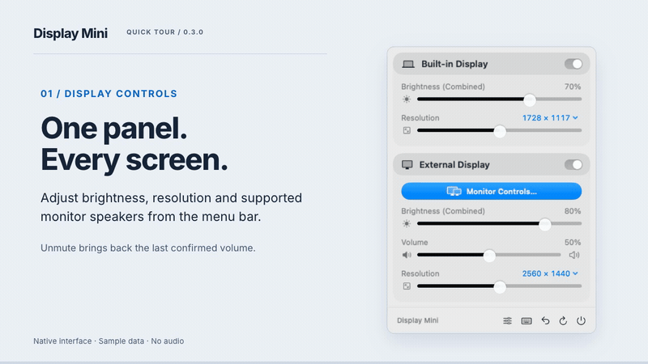
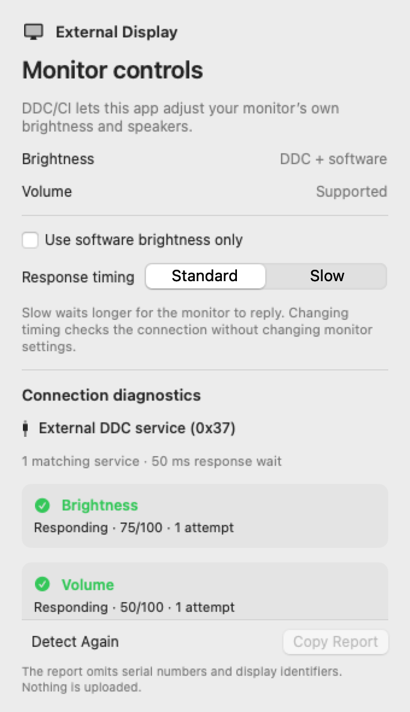
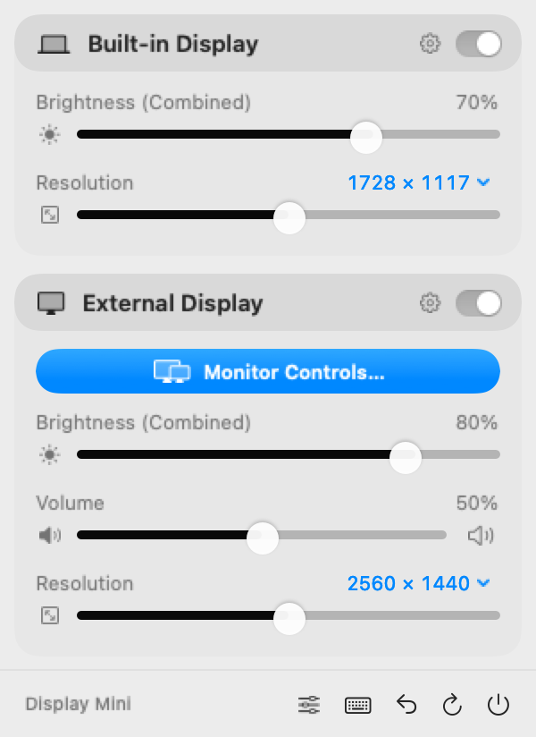
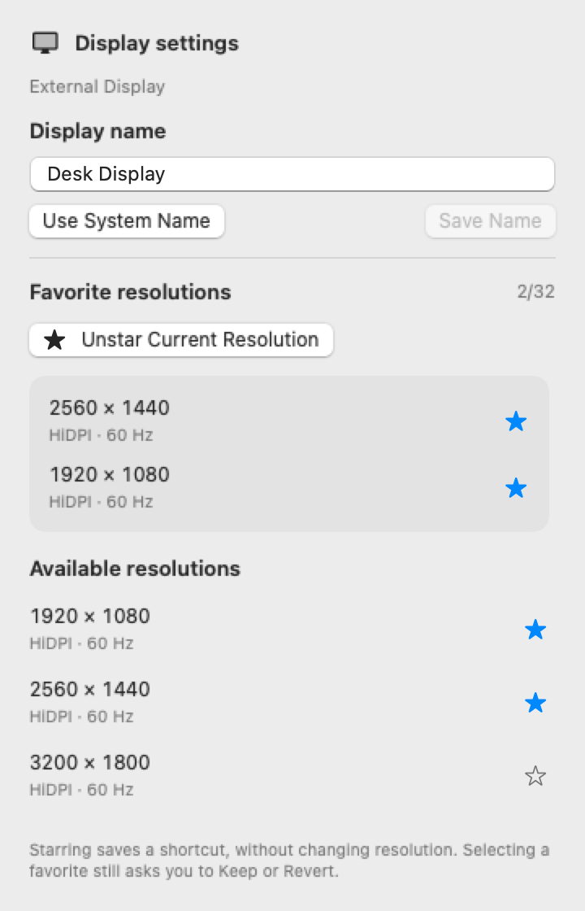
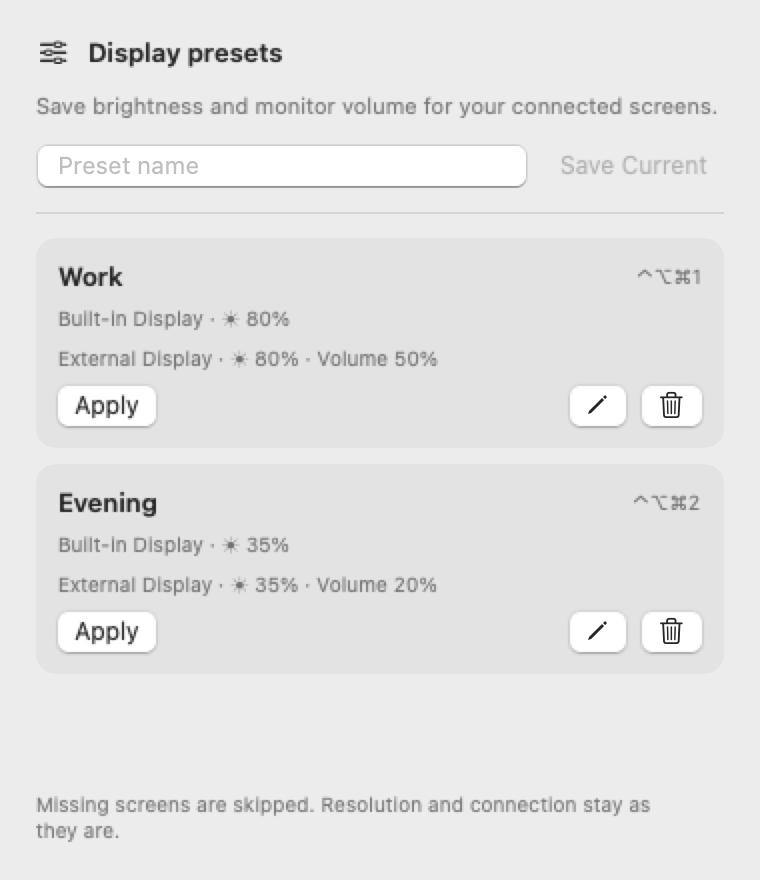
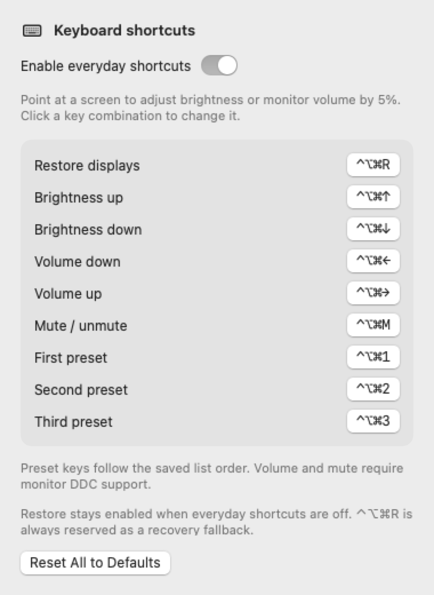
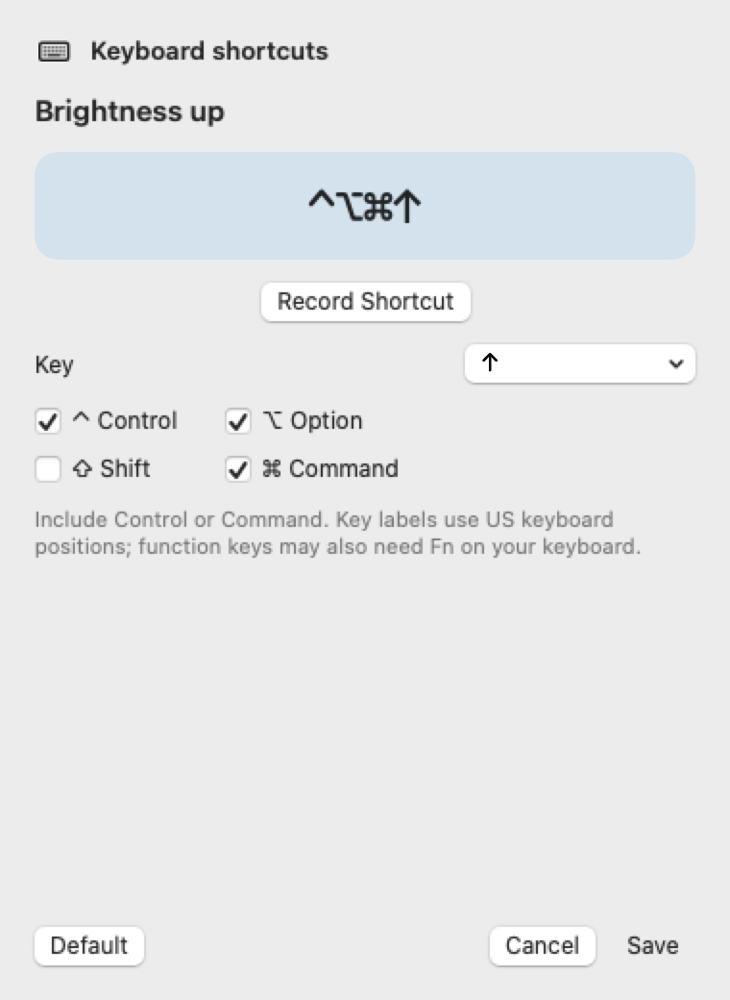
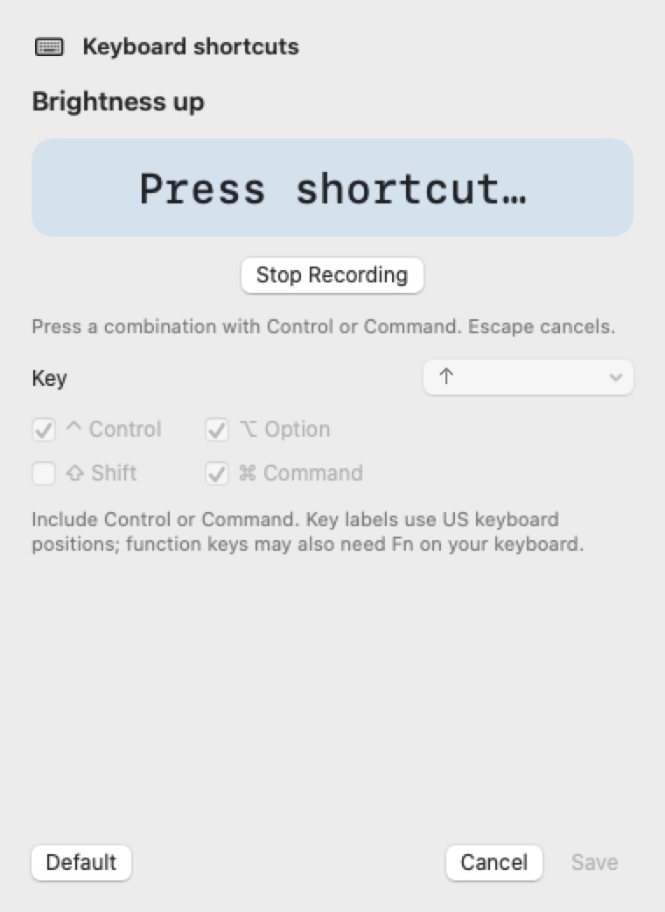
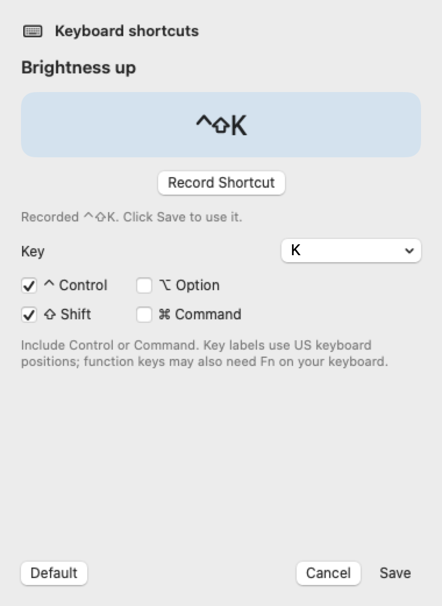

# User guide

## Quick start

1. Open Display Mini and click its monitor icon in the menu bar.
2. Adjust brightness or resolution under the screen you want to control. External volume and mute appear when supported.
3. Open the sliders button in the footer to save your current levels as a preset.
4. Open the keyboard button, choose an action, click **Record Shortcut**, and press a combination containing Control or Command.
5. Review the captured keys and click **Save**. Point at the screen you want to control before using its shortcut.

[Download the silent MP4](media/walkthrough.mp4). All images and video show native interface examples from 0.3.0 with sample data. They illustrate the workflow and do not certify support for a particular display.

| Time | Walkthrough transcript |
| --- | --- |
| 0:00 | Open the compact panel to adjust brightness, resolution and supported monitor speakers. |
| 0:05 | Set your levels, name a preset, and use Save Current. Apply it again when needed. |
| 0:10 | Open keyboard settings and click the action's current shortcut. |
| 0:13 | Click Record Shortcut. You can also choose keys and modifiers manually. |
| 0:16 | Press a supported combination containing Control or Command. Escape cancels. |
| 0:19 | Review the captured keys, then Save. Conflicting assignments show a message. |

## Connection diagnostics and response timing

Open **Monitor Controls…** on an external display. The panel shows its current brightness method and whether monitor volume has responded. **Standard** waits 50 ms for DDC replies; **Slow** waits 150 ms and can help slower monitors. Timing is remembered for each display. Selecting a profile starts a read-only check without changing monitor settings.

The diagnostics section lists the verified DDC route, matching service count, response wait and last check time. Brightness and volume have separate outcomes. **Responding** includes the raw current/maximum and attempts. **Not supported by monitor** means an explicit unsupported reply; **No valid reply** means communication failed and does not establish whether the feature exists.

**Detect Again** repeats the bounded check. **Copy Report** puts the latest report on your clipboard, omitting serials, UUIDs, display names, registry paths and local paths. It includes app/macOS version, vendor/model codes, resolution, timing, route and control outcomes. Nothing is uploaded. Copying replaces the current clipboard contents.

Software dimming remains available when the connection cannot be uniquely matched. Two monitors reporting the same vendor/model/serial cannot safely be distinguished by this release. A readable, valid EDID is required for DDC routing; timing changes cannot fix a dock that does not forward DDC.

## The panel

Click the monitor icon in the menu bar. Each known display has a title row with its name and connection switch. Built in displays show brightness and resolution. External displays also show monitor controls and volume.

The footer buttons, from left to right after the app name, open **Presets**, open **Keyboard Shortcuts**, **Restore Displays**, **Refresh Displays**, and **Quit**.

Values come from macOS or the monitor. Detection may take a moment. An unavailable control stays disabled instead of displaying a made up measured value. The panel refreshes when screens change, after wake, and when you use Refresh.

## Screen names and favorite resolutions

Click the **gear beside a screen's name** to open Display Settings. Enter a label such as Desk Display and choose **Save Name**. **Use System Name**, or saving an empty name, restores the original label. Names can contain up to 40 characters and appear in controls and preset labels. They do not change the monitor's name in macOS Settings.

<picture>
  <source media="(prefers-color-scheme: dark)" srcset="media/display-settings-dark.png">
  
</picture>

Choose **Star Current Resolution**, or click a star beside an available resolution. Up to 32 favorites can be saved for each screen. Available favorites appear at the top of that screen's resolution menu. Selecting one starts the usual 15 second **Keep** or **Revert** preview; selecting the current mode does nothing.

Starring or removing a favorite saves a preference without switching modes. A favorite that is temporarily unavailable stays in Display Settings with an **Unavailable** label and can still be removed. Its dimensions, pixel density and refresh rate must match a mode currently reported by macOS before it can be selected.

Names and favorites stay on this Mac and follow the display UUID. If a different cable, dock or screen reports a different UUID, it will not inherit another screen's settings. An unidentified screen cannot save these preferences until its stable identity is available. Unreadable saved data is preserved; **Back Up and Reset Display Settings** starts fresh while keeping a local backup. It resets only names and favorites.

## Brightness

**Combined** means hardware brightness and software dimming share one slider:

| Slider range | Result |
| --- | --- |
| 20% through 100% | Hardware brightness scales from its minimum to maximum. |
| Below 20% | Hardware stays at its minimum and a dark overlay adds dimming. |

Built in and Apple displays use DisplayServices, with native brightness clamped above absolute zero. Other supported monitors use DDC/CI. A combined or software percentage is not the monitor's physical backlight percentage, so numbers can differ from the monitor's own menu or another utility.

**Software** means the app darkens the image with an overlay because hardware control is unavailable or software mode was selected. This does not reduce the monitor's backlight setting. The overlay leaves a small nonzero visibility floor. Closing the app removes its overlays.

Writes are briefly debounced to avoid flooding the monitor while dragging. DDC writes are read back before being considered confirmed. A rejected or unconfirmed change displays an error.

## External monitor volume

Volume controls the monitor's speakers through DDC VCP code `0x62`. It does not set Mac speaker volume or change the selected macOS audio output.

macOS still needs the correct audio output, and the cable must carry audio. Brightness support does not guarantee volume support. If the monitor cannot report current volume and a valid maximum, the slider is unavailable.

## Mute

Click the speaker button beside an external display's volume slider to mute it. Display Mini writes volume zero and waits for monitor confirmation. Click again to restore the last confirmed nonzero volume for that display. The remembered value survives restarting the app. If no previous value is known, unmute uses 25%.

A failed write shows an error and restores the previous displayed value. Moving the volume above zero also leaves mute. The button waits for pending control changes to finish. This controls monitor speakers through volume, not a monitor-specific mute command or the Mac's audio output.

## Presets

Open **Presets** using the sliders icon in the footer. Set your brightness and monitor volume first, enter a name such as Work or Evening, and choose **Save Current**. Each preset saves the confirmed levels for every connected display. Saving waits for detection and pending writes to finish.

You can save up to 12 presets. Names must be unique, 1–40 characters, and contain no control characters. Each row shows the screens and levels it contains. Use **Apply**, the pencil to rename, or the trash button to delete. To replace levels, delete the old preset and save a new snapshot.

Applying matches each saved screen by its display UUID, not its name or list position. A missing screen or unavailable volume control is skipped and counted in the result. New screens not in the preset stay unchanged. If no saved screens are connected, nothing is changed. The app reports write failures and keeps the per-display error available to inspect.

Preset application changes only brightness and volume. Resolution, display connection, response timing and brightness method stay unchanged. One control write finishes before the next begins. Other display edits wait during application, but **Restore Displays** remains available and interrupts it. Sleep and display changes also interrupt it. A change already sent to a monitor may complete; interruption does not promise rollback. The app re-reads controls after interrupted writes before allowing another snapshot.

Presets are local to this Mac and survive relaunch. If saved data cannot be read, it is preserved and an explicit **Back Up and Reset Presets** action creates a fresh library while retaining a local backup.

## Keyboard shortcuts

Brightness, volume and mute target the screen under the pointer. An unavailable control produces a message instead of changing a different screen. The keyboard button in the footer lists your current keys, lets you edit each action, and shows any registration conflicts. The table below lists the defaults.

| Keys | Action |
| --- | --- |
| Control + Option + Command + ↑ / ↓ | Brightness up / down, 5 percentage points |
| Control + Option + Command + ← / → | Monitor volume down / up, 5 percentage points |
| Control + Option + Command + M | Mute or restore monitor volume |
| Control + Option + Command + 1 / 2 / 3 | Apply the corresponding preset in saved list order |
| Control + Option + Command + R | Restore displays and open the panel |

Preset shortcuts affect all matching screens in the preset, regardless of pointer location. Deleting a preset shifts the following shortcut positions. Brightness and volume clamp at their limits. Unsupported monitor volume, including Mac speakers, is not redirected elsewhere.

To change a shortcut, click its key combination, click **Record Shortcut**, and press the combination on your keyboard. Review the captured keys, then click **Save**. **Escape** or **Stop Recording** cancels capture without changing the draft. Closing the editor or switching away stops recording. You can still select a key from the compact grouped menu and choose Control/Option/Shift/Command manually.

| 1. Start recording | 2. Press the keys | 3. Review and Save |
| --- | --- | --- |
|  |  |  |

Include at least Control or Command. Letters, digits, arrows, F1–F12, Space, Home/End and Page Up/Down are supported. Unsupported combinations show a message and keep listening. Modifier keys alone do not finish recording. Labels describe US physical keyboard positions; some keyboards require Fn for function keys. **Default** fills the current action's original binding; **Reset All to Defaults** restores the whole set.

While the shortcut editor is open and Display Mini is active, its registered shortcuts are captured or ignored instead of running display actions. This includes the keyboard recovery fallback and prevents a held key from changing a display after capture. Close the editor or switch away to use those keys again. The panel's **Restore Displays** button remains available. Combinations reserved by macOS or another app may never reach the recorder; choose another combination if nothing is captured.

Duplicate assignments inside Display Mini are rejected. If macOS cannot register an edited combination, the old bindings stay active and the new preference is not saved. Registration cannot detect every shortcut used inside individual apps, so avoid combinations you use elsewhere. Changes persist across relaunch. Preset row labels follow your custom bindings.

**Enable everyday shortcuts** is on by default and remembered across launches. Turning it off releases everyday keys. You can edit while they are off; new combinations are checked when you enable them. Conflicting registrations are listed, and available keys keep working. Both the customized Restore shortcut and the fixed **Control + Option + Command + R** recovery fallback remain independently enabled. That fallback cannot be assigned to another action.

If saved bindings cannot be read, defaults become active and the original data is kept. The next explicit save/reset backs up that unreadable data locally. Recording listens only for events sent to Display Mini during an explicit recording session. No keystroke history is collected, and no Accessibility or Input Monitoring permission is required. Media keys are not supported.

## Monitor Controls

Open **Monitor Controls…** or **Configure DDC…** on an external display to inspect support.

* **Detect Again** retries capability reads.
* **Use software brightness only** selects overlay dimming even when hardware brightness is available.
* Communication errors appear in this panel.

Enable DDC/CI through the monitor's physical controls and on screen menu. Display Mini cannot enable it in firmware that blocks communication. Try a direct cable when a dock or adapter blocks DDC; no particular port guarantees support on every monitor.

## Resolution

The slider provides one stop per logical size. The resolution label opens the full list, including density and refresh variants reported by macOS.

The slider tries to preserve current density and refresh rate when selecting another size. HiDPI modes use more physical pixels than the logical desktop size. Display Mini does not manufacture unsupported resolutions or create virtual displays.

Releasing the slider or selecting a mode starts a preview with **Keep** and **Revert**. The app attempts to restore the previous mode after 15 seconds unless you keep it. Keep saves the mode through macOS display configuration.

Only one preview is active at a time. If a display disappears or rollback fails, the recovery record is retained. Reconnect the screen and use **Revert** or **Restore Displays**. After a restart, unresolved recovery can be explicitly dismissed with **Keep current resolution** when shown.

## Connection switches

Turning a display off disconnects it from the macOS desktop. Windows can move to the remaining display. This is connection management, not merely drawing a black window or sending a physical monitor power command.

The last active display cannot be disconnected. An owned disconnected screen remains listed for reconnection. Availability depends on the private macOS connection API and display path.

If you turn off the built in screen using Display Mini, unplugging the last active external screen makes the app attempt to reconnect it automatically. The lid must be open. Recovery checks every two seconds while the app owns a disabled built in screen, so it also works when a screen notification is missed. It retries when macOS temporarily omits the panel and keeps the recovery record until the panel is both online and active. Closed lids, sleep, and an active external screen pause automatic recovery.

Automatic recovery requires Display Mini to be running. If the lid state cannot be read, use **Restore Displays** or the recovery shortcut instead.

Recovery also checks supported hardware port events because macOS can temporarily keep an unplugged screen in its active display list. Hardware based recovery is used only when those ports covered all active external screens before you disabled the built in screen. The recovery task prevents App Nap from delaying its checks; normal Mac sleep remains available.

macOS may stop returning a UUID for a disconnected screen. The app retains its vendor, model, and serial identity and checks current display IDs. If the match is ambiguous, it does not guess which screen to operate.

## Footer and recovery

| Button | Action |
| --- | --- |
| Sliders icon | Save and manage brightness/volume presets. |
| Keyboard icon | Shortcut reference, enable switch and registration errors. |
| Curved arrow | Restore screens and pending changes owned by Display Mini. |
| Circular arrow | Refresh discovery and control values. |
| Power icon | Quit the app. |

**Control + Option + Command + R** performs recovery and opens the panel. Recovery attempts to reconnect owned disconnections, roll back a pending mode, remove dimming, and raise displays in the lowest brightness range to a readable level.

Recovery is best effort. A physically unplugged monitor must be reattached. Ambiguous identity, a removed mode, or a changed private API may require macOS Displays settings, cable reconnection, or logging out. Read the error before dismissing recovery information.

## Scope

The preview has no brightness/volume media key remapping, automatic updates, DDC power-off command, rotation, mirroring configuration, virtual displays, or scheduling. It focuses on the controls above.
